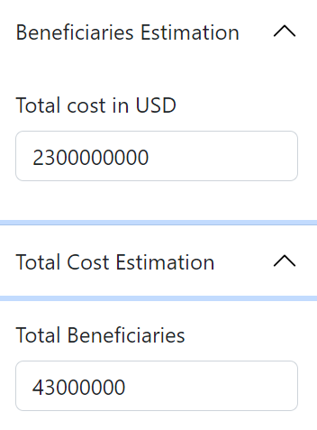

```{r setup, include=FALSE}
knitr::opts_chunk$set(echo = TRUE)
library(tidyverse)
library(xlsx)
library(writexl)
library(fs)
library(echarts4r)
library(expss)
library(janitor)
library(haven)
library(DT)
```

RBD RAM, in collaboration with Supply Chain and BPU conducted a joint analysis to quantify the impacts of the World Food Programme’s funding shortfalls in the Western Africa region in 2021 and 2022, and to estimate the potential impacts on food insecure populations and WFP future operations. 

The main methodology aligns with that of the **Cost of Inaction on WFP Food Assistance in Eastern Africa (2021 & 2022)**, with additional analyses conducted to try understand what % of assistance cost goes directly to beneficiaries.   
This analysis was conducted based on available data collected from different WFP corporate databases as of 27 July 2023. One of the limitations faced was that data from different sources covering different periods were compiled, leading to possible discrepancies. 


The different data sources used are as follows: 

  * Distributed quantities (Food MT and Cash-Based Transfers USD): COMET/DOTS (*commodity last*)
```{r echo=FALSE}
 xfun::embed_file("Final data used/commodity last.xlsx")
```

  
  * Budget: Funding outlook from the Management plan  which is the funding situation of RBD     by country as of July 2023, including available funds and new contributions in 2023 (*Funding outlook 2023*)
```{r echo=FALSE}
xfun::embed_file("Final data used/Funding outlook 2023.xlsx")
```
  

  * Expenditures: WINGS FM System (*last data expenditure 2019 2022*)
```{r echo=FALSE}
xfun::embed_file("Final data used/last data expenditure 2019 2022.csv")
```
  

  * Beneficiaries: COMET Needs-Based Plan (ACR figures) (*New_data_benef_06_07_2023*)
```{r echo=FALSE}
xfun::embed_file("Final data used/New_data_benef_06_07_2023.xlsx")
```

  * Assistance days: COMET (*Assistance_days*)
```{r echo=FALSE}
xfun::embed_file("Final data used/Assistance_days.xlsx")
```

  * Nutritional Values: NutVal application  (*nutrition*)
```{r echo=FALSE}
xfun::embed_file("Final data used/nutrition.xlsx")
```

  * Food baskets (equivalent of the value of assistance in kcal) (*equivalent*)
```{r echo=FALSE}
xfun::embed_file("Final data used/equivalent.xlsx")
```
  

  * Food security outcomes (FCS) (*FCS Acceptable*)
```{r echo=FALSE}
xfun::embed_file("Final data used/FCS Acceptable.xlsx")
```

  * CH data 

NB: It should be noted that data for only URT1 (Unconditional Resource Transfer 1) was used to conduct this analysis.

# DAtABASES

## Expenditure basis

The data **last data expenditure 2019 2022** was provided by BPU.

From this database, we use the variables: *Country, Fiscal Year, Modality, Expenditures (USD)* 

We transpose the *Modality* variable to treat each modality as a variable in the database (i.e. *Food Value, FTC External Transport, Food Transfer Cost, CBT CV Value, CBT CV Transfer Cost, Capacity Strengthening, Implementation, Cargo Preference, Service Delivery*). 

In the same file, we calculate total food expenses (*varname total_cost_food*) and total CBT value expenses (*varname total_cost_CBT*). 

For *total_cost_food*, we sum the following variables: *Food Value, Food Transfer Cost, FTC External Transport* and *Cargo Preference*, such that: 

*total_cost_food = Food Value + Food Transfer Cost + FTC External Transport + Cargo Preference*

*For total_cost_CBT*, we sum the following variables: *CBT CV Value* and *CBT CV Transfer Cost*, such that: 

*total_cost_CBT = CBT CV Value + CBT CV Transfer Cost*

Next, we calculate the ISC (Indirect Support Cost) which is equivalent to 6.65% of Implementation. 2 new variables are generated: *ISC_Food* and *ISC_cbt*. 

Next, we generate the following:

*total_cost_implementation_food = total_cost_food + Implementation_food*,

*total_cost_implementation_CBT = total_cost_CBT + Implementation_CBT*

Finally, we generate the variable *total_cost_final_food* and *total_cost_final CBT* as follows: 

*total_cost_final_food = total_cost_implementation_food + isc_food*,

*total_cost_final_CBT = total_cost_implementation_CBT + isc_CBT*


```{r}

expenditure <- read.csv("Final data used/last data expenditure 2019 2022.csv")
expenditure <- expenditure |> filter(
  Fiscal.Year %in% c(2019:2022) 
)

expenditure3 <- expenditure |> select(
  Country, Fiscal.Year, Modality, Expenditures..USD.
)

expenditure3 <- expenditure3 |> group_by(
  Country, Fiscal.Year,Modality,
) |> summarise(expend = sum(Expenditures..USD.))

expenditure4 <- expenditure3 |> pivot_wider(
  names_from = Modality, values_from = expend
)

# calcul total food cost
expenditure4 <- expenditure4 |> mutate(
  `Food Value` = case_when(
    is.na(`Food Value`) ~ 0,
    TRUE~ `Food Value`
  ),
  `Food Transfer Cost` = case_when(
    is.na(`Food Transfer Cost`) ~ 0,
    TRUE~ `Food Transfer Cost`
  ),
  `FTC External Transport` = case_when(
    is.na(`FTC External Transport`) ~ 0,
    TRUE ~ `FTC External Transport`
  ),
  `Cargo Preference` = case_when(
    is.na(`Cargo Preference`) ~ 0,
    TRUE ~ `Cargo Preference`
  )
  
) |> mutate(
  total_cost_food = `Food Value` + `Food Transfer Cost` + `FTC External Transport` +`Cargo Preference`)

#remetre les NA
expenditure4 <- expenditure4 |> mutate(
  `Food Value` = case_when(
    `Food Value` == 0 ~ NA,
    TRUE~ `Food Value`
  ),
  `Food Transfer Cost` = case_when(
    `Food Transfer Cost` == 0 ~ NA,
    TRUE~ `Food Transfer Cost`
  ),
  `FTC External Transport` = case_when(
    `FTC External Transport` == 0 ~ NA,
    TRUE ~ `FTC External Transport`
  ),
  `Cargo Preference` = case_when(
    `Cargo Preference` == 0 ~ NA,
    TRUE ~ `Cargo Preference`
  )
 
  
)

expenditure4 <- expenditure4 |> rename(
  Year = "Fiscal.Year"
) |> relocate(
  c(`Food Value`,`Food Transfer Cost`,`Cargo Preference`), .after = `FTC External Transport`
)


expenditure4 <- expenditure4 |> relocate(
  `FTC External Transport`, .after = `Food Transfer Cost`
)


expenditure4 <- expenditure4 |> relocate(
  total_cost_food, .after = `Cargo Preference`
)

expenditure4 <- expenditure4 |> relocate(
  Implementation, .after = `Service Delivery`
)

expenditure4 <- expenditure4 |> mutate(
  `CBT CV Value` = case_when(
    is.na(`CBT CV Value`) ~ 0,
    TRUE~ `CBT CV Value`
  ),
  `CBT CV Transfer Cost` = case_when(
    is.na(`CBT CV Transfer Cost`) ~ 0,
    TRUE~ `CBT CV Transfer Cost`
  )
  
) |> mutate(
  total_cost_CBT = `CBT CV Value` + `CBT CV Transfer Cost` )

expenditure4 <- expenditure4 |> mutate(
  `CBT CV Value` = case_when(
    `CBT CV Value` == 0 ~ NA,
    TRUE~ `CBT CV Value`
  ),
  `CBT CV Transfer Cost` = case_when(
    `CBT CV Transfer Cost` == 0 ~ NA,
    TRUE ~ `CBT CV Transfer Cost`
  )
)

expenditure4 <- expenditure4 |> relocate(
  `CBT CV Value`, .before = `CBT CV Transfer Cost`
)

expenditure4 <- expenditure4 |> mutate(
  all_modalities_cost = total_cost_food + total_cost_CBT
) |> relocate(all_modalities_cost, .before = Implementation)

expenditure4 <- expenditure4 |> mutate(
  food_cost_percent = round((total_cost_food/all_modalities_cost),3),
  CBT_cost_percent = round((total_cost_CBT/all_modalities_cost),3)
) |> relocate(
  food_cost_percent, .after = total_cost_food
) |> relocate(
  CBT_cost_percent, .after = total_cost_CBT
)

expenditure4 <- expenditure4 |> mutate(
  Implementation_food =  food_cost_percent * Implementation,
  Implementation_CBT = CBT_cost_percent * Implementation
) |> relocate(
  c(Implementation_food,Implementation_CBT), .after = Implementation
)

# cost food et cbt + implementation food et cbt
expenditure4 <- expenditure4 |> mutate(
  total_cost_implementation_food = total_cost_food + Implementation_food,
  total_cost_implementation_CBT = total_cost_CBT + Implementation_CBT
)

# ISC food et cbt
expenditure4 <- expenditure4 |> mutate(
  isc_food = total_cost_implementation_food*0.065,
  isc_CBT = total_cost_implementation_CBT*0.065
)

# total cost + ISC 
expenditure4 <- expenditure4 |> mutate(
  total_cost_final_food = total_cost_implementation_food + isc_food,
  total_cost_final_CBT = total_cost_implementation_CBT + isc_CBT
)

```

## Grouping of countries
In the file **last data expenditure 2019 2022** provided by BPU, countries are not grouped, i.e. coastal countries, Sahel countries, Cameroon, CAR and Nigeria. To facilitate analysis, we group the countries accordingl

```{r}
group_country <- data.frame(
  stringsAsFactors = FALSE,
                              Country = c("Benin","Burkina Faso","Cameroon",
                                        "Cape Verde","Central African Republic","Chad",
                                        "Cote d'Ivoire","Gambia","Ghana",
                                        "Guinea","Guinea-Bissau","Liberia",
                                        "Mali","Mauritania","Niger","Nigeria",
                                        "Sao Tome and Principe","Senegal",
                                        "Sierra Leone","Togo"),
                           Group  = c("Coastal","Sahel","CAR/CMR/NGA","Coastal",
                                        "CAR/CMR/NGA","Sahel","Coastal",
                                        "Coastal","Coastal","Coastal","Coastal",
                                        "Coastal","Sahel","Sahel","Sahel",
                                        "CAR/CMR/NGA","Coastal","Coastal",
                                        "Coastal","Coastal")
                 )
```


## Beneficiary database

In the database **New_data_benef_06_07_2023**, to avoid confusion, we renamed the following  variables :

*Actual.Food., Actual.CBT.* and *Actual.Total.* to *benef_food, benef_CBT* and *total_beneficiaries*

```{r }

beneficiaire <- read.xlsx("Final data used/New_data_benef_06_07_2023.xlsx",sheetName = 1)

# )

# renommer les variables de beneficiaires
beneficiaire_urt <- beneficiaire |> rename(
  benef_food = Actual.Food.,
  benef_CBT = Actual.CBT.,
  total_beneficiaries = Actual.Total.
)

```

## Commodity Database
In the file **commodity last** provided by Supply Chain, we refer to the variables: 

*Commodity_Name, SUM_of_Distributed_Quantity_MT* and *SUM_of_Cmdty_value_distributed.*
The daily cost per beneficiary is calculated using the formula below: 

In order to calculate Total Cost (incl. ISC) in terms of Kcal, we converted the *SUM_of_Distributed_Quantity_MT* into Kcal by following the below steps: 

1.	Match the commodity name used in the **commodity last** file with commodity names listed in the **equivalent** file. For example, “Beans” in the **commodity last** file was matched with “BEANS, KIDNEY, ALL TYPES” from the equivalent file. 

2.	Using the commodity name from the **equivalent** file, we search for the Kcal value using the **nutrition** file. The **nutrition** file was generated from the NutVal app. 
Given that the *SUM_of_Distributed_Quantity_MT* is in MT, later we convert the MT into grams to calculate the Kcal value (as explained in section 2).  


```{r}
commodities <- read.xlsx("Final data used/commodity last.xlsx",sheetName = 1)
# regrouper par commodité
commodities2 <- commodities |> dplyr::group_by(
  Country_Name, Group, Document_Year,Commodity_Name
) |> summarise(
  Tot_qtityMT = sum(SUM_of_Distributed_Quantity_MT, na.rm = TRUE),
  # Cmdty_Price_USD = mean(Cmdty_Price_USD, na.rm=TRUE),
  Tot_Value_distributed = sum(SUM_of_Cmdty_value_distributed, na.rm = TRUE)
)
# importer la base dans laquelle nutval pour avoir les équivalents Kcal
equivalent <- read.xlsx("Final data used/equivalent.xlsx", sheetName = 1)
nutriton <- read.xlsx("Final data used/nutrition.xlsx",sheetName = 1)


commodities3 <- commodities2 |> mutate(
  var_equivalent = vlookup(lookup_column = "Commodity_Name",dict = equivalent,result_column = "equivalent",lookup_value = Commodity_Name )
) |> mutate(
  kcal = vlookup(lookup_column = "Food.Commodities.and.Products",dict = nutriton,result_column = "kcal",lookup_value = var_equivalent )
)

commodities3 <- commodities3 |> 
  rename(
    Country = Country_Name,
    Year = Document_Year
  )

```


## FCS database 
In order to get a general sense of how change in assistance affects beneficiaries, we calculate the % of those in poor and borderline FCS using the file **FCS Acceptable** (i.e. 100% - % of population in FCS Acceptable = % of population in FCS Poor and Borderline). 

```{r}
fcs <- read.xlsx("Final data used/FCS Acceptable.xlsx",sheetName = 1)
fcs <- fcs |> select(Country, everything())
fcs <- fcs |> mutate(
  # FCS_acceptable = round(Acceptable.FCS,2)
   FCS_poor_borderline = round((100 - Acceptable.FCS),2)
)  |> select(-Acceptable.FCS)

fcs$Year <- as.numeric(fcs$Year)
```

## Assistance days

We then import sheet 1 for # of food assistance days and sheet 2 for # of CBT assistance days from the file **Assistance_days**. 
```{r}
## Assistance days
assistance_food <- read.xlsx("Final data used/Assistance_days.xlsx",sheetName = 1)
assistance_cash <- read.xlsx("Final data used/Assistance_days.xlsx",sheetName = 2)

assistance_cash$Year <- as.numeric(assistance_cash$Year)
```


#	Joining of databases

This step involves joining the 7 databases: **commodity last, last data expenditure 2019 2022, New_data_benef_06_07_2023, Assistance_days, nutrition, equivalent** and **FCS Acceptable**. 

To join the files, we use the following as reference variables: Country, Year and Group. 

We then calculate the Kcal value for each commodity; since NutVal (**nutrition**) gives the Kcal value per 100g, and the data in **commodity last** is in MT, we multiply Tot_qtityMT by 10000  and by the corresponding Kcal value. 

For example, for 100g of cassava, the corresponding Kcal is 15. In order to calculate the Kcal equivalent of 20MT of cassava, the formula is 20 * 10000 * 15 which gives 3,000,000 Kcal for 20MT.


```{r}

beneficiaire_urt$Year <- as.numeric(beneficiaire_urt$Year)
# jointure beneficaire et expenditure
benef_expend <- beneficiaire_urt  |> left_join(
  expenditure4, by = c("Country","Year")
)

benef_expend2 <- benef_expend |> mutate(
  Group = maditr::vlookup(lookup_column = "Country",dict = group_country,result_column = "Group",lookup_value = Country
                    )
)

benef_expend2 <- benef_expend2 |> relocate(
  Group, .after = "Country"
)


#différence entre les deux datasests
setdiff(unique(commodities3$Country), unique(benef_expend2$Country))
setdiff(unique(benef_expend2$Country),unique(commodities3$Country))

benef_expend_assist <- benef_expend2 |> left_join(
  assistance_food, by = c("Country","Group","Year")
)

benef_expend_assist <- benef_expend_assist |> left_join(
  assistance_cash, by = c("Country","Group","Year")
)

benef_expend_assist_fcs <- benef_expend_assist |> left_join(
  fcs, by = c("Country","Group","Year")
)

setdiff(unique(commodities3$Country), unique(benef_expend_assist_fcs$Country))
setdiff(unique(benef_expend_assist_fcs$Country),unique(commodities3$Country))

all_country <- unique(benef_expend2$Country)
missing_in_commodities3 <- c("Central African Republic","Senegal","Guinea-Bissau","Liberia",
                             "Ghana")

country_in_commodities3 <- all_country[!(all_country %in% missing_in_commodities3)]

benef_expend_assist_fcs2 <- benef_expend_assist_fcs |> filter(
  Country %in% country_in_commodities3
)

benef_expend_assist_fcs3 <- benef_expend_assist_fcs |> filter(
  Country %in% missing_in_commodities3
)

#Jointure commodities et autres bases
commo_benef_exp_days_FCS <- commodities3 |> left_join(
  benef_expend_assist_fcs2, by = c("Country","Group","Year")
)

# ajouter les pays manquants à la base
setdiff(names(commo_benef_exp_days_FCS), names(benef_expend_assist_fcs3))

benef_expend_assist_fcs3 <- benef_expend_assist_fcs3 |> mutate(
  Commodity_Name = NA,Tot_qtityMT = NA,Tot_Value_distributed = NA,var_equivalent = NA,
  kcal = NA
)

commo_benef_exp_days_FCS <- commo_benef_exp_days_FCS |> bind_rows(
  benef_expend_assist_fcs3
)


commo_benef_exp_days_FCS <- commo_benef_exp_days_FCS |> mutate(
  total_kcal = round(Tot_qtityMT * 10000 * kcal,2)
)

commo_benef_exp_days_FCS <- commo_benef_exp_days_FCS |> relocate(
  total_kcal, .after = Tot_qtityMT
)

```

#	Daily CpB Food and CBT Calculation 

We calculate the daily cost per beneficiary (CpB) for food as well as for CBT using the same aforementioned equation:


The final database with all the variables and calculations is:  **Final_data_COI**

```{r echo=FALSE}
xfun::embed_file("Final data used/final_data_COI.xlsx")
```


```{r}
#daily cost per beneficiary food
final_dataset_COI <- commo_benef_exp_days_FCS |> mutate(
  daily_CpB_food = round(total_cost_final_food/(benef_food*assistance_days_food_2),2)
)


final_dataset_COI <- final_dataset_COI |> mutate(
  daily_CpB_CBT = round(total_cost_final_CBT/(benef_CBT*assistance_days_CBT_2),2)
)

# CpB food pour benefeciary total from commodity data
final_dataset_COI <- final_dataset_COI |> mutate(
  daily_CpB_food_benef = round(Tot_Value_distributed/(benef_food*assistance_days_food_2),2)
)


final_dataset_COI <- final_dataset_COI |> mutate(
  daily_CpB_CBT_benef = round(`CBT CV Value`/(benef_CBT*assistance_days_CBT_2),2)
)

final_dataset_COI <- final_dataset_COI |> mutate(
  total_cost_final_food = case_when(
    is.na(total_cost_final_food) ~ 0,
    TRUE~ total_cost_final_food
  ),
  total_cost_final_CBT = case_when(
    is.na(total_cost_final_CBT) ~ 0,
    TRUE~ total_cost_final_CBT
  )
)

final_dataset_COI <- final_dataset_COI |> mutate(
  total_beneficiaries = case_when(
    is.na(total_beneficiaries) ~ 0,
    TRUE~ total_beneficiaries
  )
)

final_dataset_COI <- final_dataset_COI |> mutate(
  assistance_days_food_2 = case_when(
    is.na(assistance_days_food_2) ~ 0,
    TRUE~ assistance_days_food_2
  ),
  assistance_days_CBT_2 = case_when(
    is.na(assistance_days_CBT_2) ~ 0,
    TRUE~ assistance_days_CBT_2
  )
)


```

# Tabulation

To produce tables with the results by country and by year, we applied the following syntax:  


```{r}
pays <- unique(final_dataset_COI$Country)
exclude_elements <- c("Sao Tome and Principe","Senegal","Guinea-Bissau","Ghana",
                      "Senegal")

pays <- pays[!(pays %in% exclude_elements)]

cpb_food <- final_dataset_COI |> filter(Country %in% pays)  |>dplyr::group_by(Country, Year) |> 
  summarise(daily_CpB_food = mean(daily_CpB_food)) |> pivot_wider(
    names_from = Year, values_from = daily_CpB_food
  ) |> mutate(
    assistance = "food"
  ) |> select(Country, assistance, 5, everything())
# #cpb by year

cpb_food <- cpb_food[-9,]
  # CpB Food per Year
colMeans(cpb_food[,3:6], na.rm = TRUE)


cpb_cbt <- final_dataset_COI |> filter(Country %in% pays) |>dplyr::group_by(Country, Year) |> 
  summarise(daily_CpB_CBT = mean(daily_CpB_CBT)) |> pivot_wider(
    names_from = Year, values_from = daily_CpB_CBT
  ) |>  mutate(
    assistance = "CBT"
  ) |> select(Country, assistance, 5, everything())


cpb_cbt <- cpb_cbt[-c(9,15),]
colMeans(cpb_cbt[,3:6], na.rm = TRUE)


##### cpb food benef ######################
cpb_food_benef <- final_dataset_COI |> filter(Country %in% pays)  |>dplyr::group_by(Country, Year) |> 
  summarise(daily_CpB_food_benef = mean(daily_CpB_food_benef)) |> pivot_wider(
    names_from = Year, values_from = daily_CpB_food_benef
  ) |> mutate(
    assistance = "food"
  ) |> select(Country, assistance, 5, everything())

cpb_food_benef <- cpb_food_benef[-c(4,9),]
  
colMeans(cpb_food_benef[,3:6], na.rm = TRUE)


cpb_cbt_benef <- final_dataset_COI |> filter(Country %in% pays) |>dplyr::group_by(Country, Year) |> 
  summarise(daily_CpB_CBT_benef = mean(daily_CpB_CBT_benef)) |> pivot_wider(
    names_from = Year, values_from = daily_CpB_CBT_benef
  ) |>  mutate(
    assistance = "CBT"
  ) |> select(Country, assistance, 5, everything())


cpb_cbt_benef <- cpb_cbt_benef[-c(8,9,15),]

colMeans(cpb_cbt_benef[,3:6], na.rm = TRUE)


###########################################################################


# cpb versus ration
cpb_food_2022 <- cpb_food |> select(
 c(1,4)
)
colnames(cpb_food_2022)[2] <- "cpb_food"


cpb_food <- cpb_food |> mutate(
  assistance = "food"
)

cpb_cbt <- cpb_cbt |> mutate(
  assistance = "CBT"
)

cpb_food_cbt <- cpb_food |> bind_rows(cpb_cbt) |> 
  arrange(Country) |> select(
    c(1,6,5,everything())
  )

## value of assistance kcal
final_dataset_COI <- final_dataset_COI |> mutate(
  value_assistance_food = round(total_kcal/(benef_food*assistance_days_food_2),2)
)
## value of assistance usd
final_dataset_COI <- final_dataset_COI |> mutate(
  value_assistance_food_usd = round(Tot_Value_distributed/(benef_food*assistance_days_food_2),2)
)

final_dataset_COI <- final_dataset_COI |> mutate(
  value_assistance_CBT = round(`CBT CV Value`/(benef_CBT*assistance_days_CBT_2),2)
)
## Value assistance food
value_assistance_food <- final_dataset_COI |> dplyr::group_by(
  Country, Year
) |> summarise(value_assistance_food = sum( value_assistance_food, na.rm = TRUE))

## Value assistance USD
value_assistance_food_usd <- final_dataset_COI |> dplyr::group_by(
  Country, Year
) |> summarise(value_assistance_food_usd = sum( value_assistance_food_usd))

value_assistance_food_year <- final_dataset_COI |> dplyr::group_by(
  Year
) |> summarise(value_assistance_food_year = sum( value_assistance_food_usd))


value_assistance_food <- value_assistance_food |> pivot_wider(names_from = Year,values_from = value_assistance_food )
value_assistance_food <- value_assistance_food[-c(4,8,10,11,17),]
value_assistance_food <- value_assistance_food |> select(
  c(1,5),everything()
)

value_assistance_food[7,2] <- NA
value_assistance_food[7,3] <- NA
value_assistance_food[12,3] <- NA
value_assistance_food[12,4] <- NA

colMeans(value_assistance_food[,2:5], na.rm = TRUE)

value_assistance_food_usd <- value_assistance_food_usd |> pivot_wider(names_from = Year,values_from = value_assistance_food_usd                                                  )


value_assistance_food_year <- colMeans(value_assistance_food[,2:5],na.rm = TRUE)

```

# Simulation/estimation of the total assistance cost and number of beneficiaries

To simulate various operational scenarios, we use the aforementioned equation. We can estimate the total number of beneficiaries that can be assisted given the daily cost per beneficiary (CpB), the number of assistance days and the total cost. Conversely, we can also simulate the necessary budget given the total number of beneficiaries, daily CpB and number of assistance days. 


To facilitate this simulation, an application has been developed: 

<https://idyise.shinyapps.io/coi_estimation/>


By inserting the expected/desired “Total cost in USD” or “Total Beneficiaries” and then clicking on the “Expand” button on the bottom right, 

 

we can simulate different operational scenarios. 



The simulations can also be exported in CSV or Excel format. 


```{r}
# Sénario 1
# estimation of total beneficiary
totalcost1 <- 2300000000
assistance_days_simulated1 <- 365
cbp_food_2022 <- 0.43
value_assistance_food_year_2022 <- 951.8742
cpb_full_simulated <- function(x){
   (x*cbp_food_2022)/value_assistance_food_year_2022
}

cpb_full_ration <- cpb_full_simulated(2100)
# cpb_full_ration = 0.9183082


benef_simulated1 = round(totalcost1/(assistance_days_simulated1*cpb_full_simulated(2100)))


# Estimation of total cost
benef_simulated1 <- 43000000
assistance_days_simulated1 <- 365
cbp_food_2022 <- 0.43
value_assistance_food_year_2022 <- 951.8742 
cpb_full_simulated <- function(x){
   (x*cbp_food_2022)/value_assistance_food_year_2022
}

cpb_full_ration <- cpb_full_simulated(2100)

totalcost_simulated = round(benef_simulated1*(assistance_days_simulated1*cpb_full_simulated(2100)))


```

## Exportation

```{r}


# write_xlsx(final_dataset_COI,"output/final_data_COI.xlsx")
# # write_xlsx(coi_tab,"output/final_data.xlsx")
# # write_xlsx(coi_tab_cbt,"output/final_data_cbt.xlsx")
# write_xlsx(cpb_food,"output/cpb_food.xlsx")
# write_xlsx(cpb_cbt,"output/cpb_cbt.xlsx")
# write_xlsx(cpb_food_cbt,"output/cpb_food_cbt.xlsx")
# write_xlsx(cpb_food_year,"output/cpb_food_year.xlsx")
# write_xlsx(cpb_CBT_year,"output/cpb_CBT_year.xlsx")
# write_xlsx(cpb_food_benef,"output/cpb_food_benef.xlsx")
# write_xlsx(cpb_cbt_benef,"output/cpb_cbt_benef.xlsx")
```
